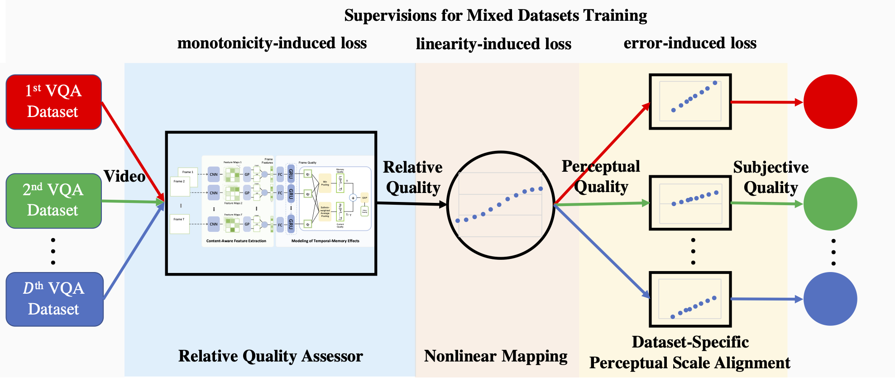

# Unified Quality Assessment of In-the-Wild Videos with Mixed Datasets Training
[](License)

## Description
MDTVSFA code for the following paper:

- Dingquan Li, Tingting Jiang, and Ming Jiang. [Unified Quality Assessment of In-the-Wild Videos with Mixed Datasets Training](https://link.springer.com/article/10.1007%2Fs11263-020-01408-w). International Journal of Computer Vision (IJCV) Special Issue on Computer Vision in the Wild, 2021. [[arxiv version]](https://arxiv.org/abs/2011.04263)


## How to?
### Install Requirements
```bash
conda create -n reproducibleresearch pip python=3.6
source activate reproducibleresearch
pip install -r requirements.txt -i https://pypi.tuna.tsinghua.edu.cn/simple
# source deactive
```
Note: Make sure that the CUDA version is consistent. If you have any installation problems, please find the details of error information in `*.log` file.

### Download Datasets
Download the [KoNViD-1k](http://database.mmsp-kn.de/konvid-1k-database.html), [CVD2014](https://www.mv.helsinki.fi/home/msjnuuti/CVD2014/) ([alternative link](https://zenodo.org/record/2646315#.X6OmVC-1H3Q)), [LIVE-Qualcomm](http://live.ece.utexas.edu/research/incaptureDatabase/index.html), and [LIVE-VQC](http://live.ece.utexas.edu/research/LIVEVQC/index.html) datasets. Then, run the following `ln` commands in the root of this project.

```bash
ln -s KoNViD-1k_path KoNViD-1k # KoNViD-1k_path is your path to the KoNViD-1k dataset
ln -s CVD2014_path CVD2014 # CVD2014_path is your path to the CVD2014 dataset
ln -s LIVE-Qualcomm_path LIVE-Qualcomm # LIVE-Qualcomm_path is your path to the LIVE-Qualcomm dataset
ln -s LIVE-VQC_path LIVE-VQC # LIVE-VQC_path is your path to the LIVE-VQC dataset
``` 

### Training and Evaluating on Multiple Datasets

```bash
# Feature extraction
CUDA_VISIBLE_DEVICES=0 python CNNfeatures.py --database=KoNViD-1k --frame_batch_size=64
CUDA_VISIBLE_DEVICES=1 python CNNfeatures.py --database=CVD2014 --frame_batch_size=32
CUDA_VISIBLE_DEVICES=0 python CNNfeatures.py --database=LIVE-Qualcomm --frame_batch_size=8
CUDA_VISIBLE_DEVICES=1 python CNNfeatures.py --database=LIVE-VQC --frame_batch_size=8
# Training, intra-dataset evaluation, for example 
chmod 777 job.sh
./job.sh -g 0 -d K -d C -d L > KCL-mixed-exp-0-10-1e-4-32-40.log 2>&1 &
# Cross-dataset evaluation (after training), for example
chmod 777 cross_job.sh
./cross_job.sh -g 1 -d K -d C -d L -c N -l mixed > KCLtrained-crossN-mixed-exp-0-10.log 2>&1 &
```

### Test Demo

The model weights provided in `models/MDTVSFA.pt` are the saved weights when running the 9-th split of KoNViD-1k, CVD2014, and LIVE-Qualcomm.
```bash
python test_demo.py --model_path=models/MDTVSFA.pt --video_path=data/test.mp4
```

### Contact
Dingquan Li, dingquanli AT pku DOT edu DOT cn.
